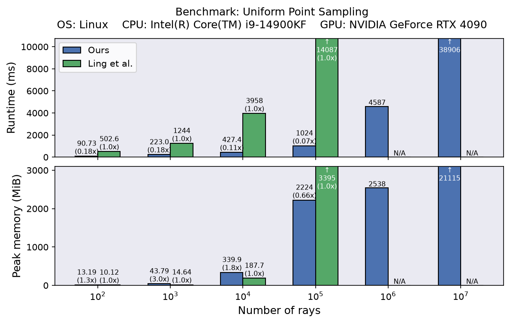

# Fast(er) Uniform Sampling of Implicit Surfaces by Casting Rays

PyTorch code for sampling uniformly distributed points on implicit surfaces represented by signed distance functions.

The implementation is based on the paper "[Uniform Sampling of Surfaces by Casting Rays](https://arxiv.org/abs/2506.05268)" (Ling et al., 2025), with the optimizations described in "[As-Rigid-As-Possible Regularization for Implicit Surfaces](https://diglib.eg.org/items/56b5824e-204a-4b00-aea4-f9753fdaa1f5)" (Djuren et al., 2026).
This repository is the official, standalone repackaging of [Djuren et al.'s sampling code](https://gitlab.com/tobidju/arap-regularization-for-implicit-surfaces/-/blob/main/iarap/sampling.py), with minor tweaks, additional documentation, and benchmarks.

The implementation is roughly an order of magnitude faster than [Ling et al.'s reference implementation](https://github.com/iszihan/implicit-uniform-sampler) and requires less memory for large ray counts, which avoids out-of-memory failures:

<div  align="center">
    
</div>

The reported numbers are averages over five runs on each of the 21 neural SDFs in our [test dataset](benchmarks/data/sdf_net_weights). 
The code for this benchmark can be found in [`benchmarks/benchmark_uniform_point_sampling.ipynb`](benchmarks/benchmark_uniform_point_sampling.ipynb).

For (implementation) details and additional benchmarks see [`benchmarks/README.md`](benchmarks/README.md).

## Getting started

Install the package using pip:
```bash
pip install git+https://github.com/mworchel/fast-implicit-uniform-sampling.git
```

We recommend using the functional interface for sampling:

```python
# Functional interface (recommended)

from fast_implicit_uniform_sampling import sample_uniform_points

# Dimensionality of the space (2D or 3D)
dim = 3 

# Callable taking an array of shape (N,dim) and returning an array with signed distances of shape (N,1) or (N,)
sdf = ... 

# PyTorch device and dtype matching what the SDF expects as input
device = ...
dtype = ...

# Returns an array of shape (P,dim) with uniformly sampled points on the zero level set
samples = sample_uniform_points(sdf=sdf, dim=dim, num_rays=1000, device=device, dtype=dtype) 
```

For compatibility, we provide a class wrapper around the functional interface that matches the interface of [Ling et al.'s reference implementation](https://github.com/iszihan/implicit-uniform-sampler):

```python
# Class wrapper, matching Ling et al.'s interface

from fast_implicit_uniform_sampling import ImplicitUniformSampler

sampler = ImplicitUniformSampler()
samples = sampler.sample(sdf, num_rays=1000)
```

## Citation

If you use this code in your research, please cite the following papers:

```bibtex
@article{Djuren:2026:ImplicitARAP,
    journal = {Computer Graphics Forum},
    title = {{As-Rigid-As-Possible Regularization for Implicit Surfaces}},
    author = {Djuren, Tobias and Worchel, Markus and Finnendahl, Ugo and Alexa, Marc},
    year = {2026},
    publisher = {The Eurographics Association and John Wiley & Sons Ltd.},
    ISSN = {1467-8659},
    DOI = {10.1111/cgf.70519}
}
```

```bibtex
@article{Ling:2025:RayCastUniformSampling,
    author = {Ling, Selena and Madan, Abhishek and Sharp, Nicholas and Jacobson, Alec},
    title = {Uniform Sampling of Surfaces by Casting Rays},
    journal = {Computer Graphics Forum},
    volume = {44},
    number = {5},
    pages = {e70202},
    doi = {https://doi.org/10.1111/cgf.70202},
    url = {https://onlinelibrary.wiley.com/doi/abs/10.1111/cgf.70202},
    eprint = {https://onlinelibrary.wiley.com/doi/pdf/10.1111/cgf.70202},
    year = {2025}
}
```
