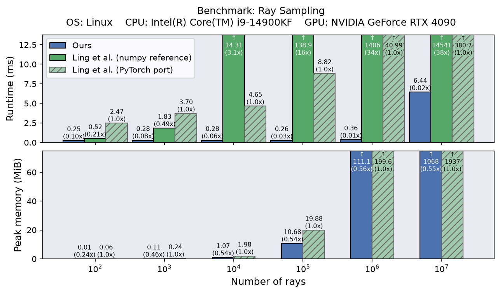
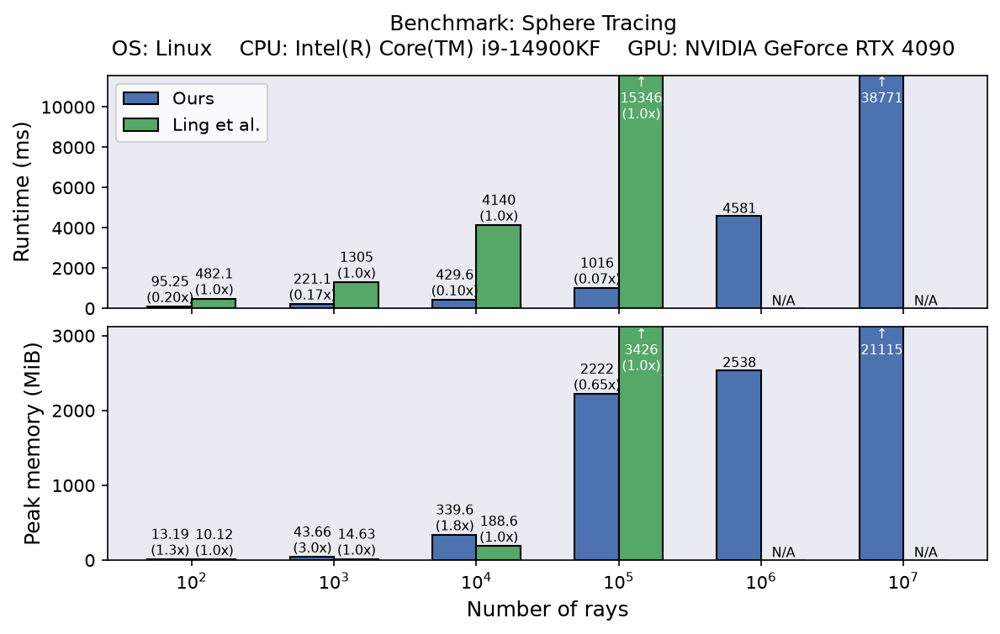
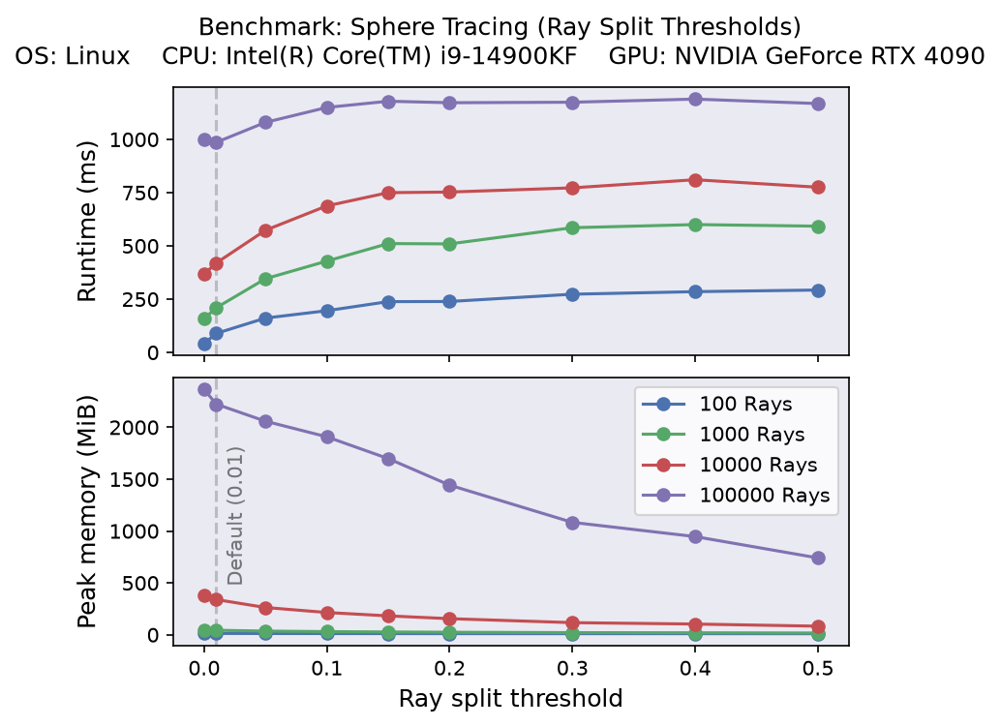
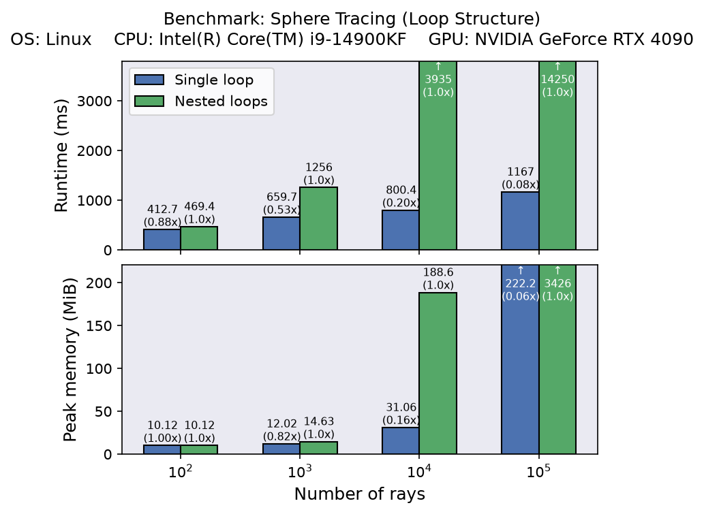

# Implementation, Optimizations, and Benchmarks

On a high level, this implementation performs the same steps as [Ling et al.'s reference implementation](https://github.com/iszihan/implicit-uniform-sampler):

1. Sample uniform rays within the bounding box of the surface ([-1, 1]^d cube)
2. Compute all intersection points between the rays and the zero-level set of the SDF using sphere tracing.

Our optimizations target both steps, but the dominant improvements come from sphere tracing.

### Uniform Ray Sampling

Uniform rays within the bounding box can be sampled by (1) sampling a random direction $\mathbf{d}$, and (2) sampling a point $\mathbf{x}$ in the plane perpendicular to the direction vector such that the ray $\mathbf{x} + t\mathbf{d}$ intersects the bounding box.

Ling et al. use rejection sampling for the second step (see their Fig.5), but this is more complex than necessary: we instead sample valid support points directly by uniformly sampling the orthogonal projection of the bounding box onto the plane. This is feasible because the projected bounding box is a polygon, which itself is just the union of the projected bounding box faces that are visible to the plane. Therefore, uniformly sampling the projected bounding box (i.e., the polygon) boils down to (1) picking one of the visible faces with probability proportional to its projected area, and (2) uniformly sampling a point on the projected face. 

This is easy to implement because the projected area is proportional to the dot product of the face normal and the direction, and uniformly sampling the orthogonal projection of a face is just uniformly sampling the face (the projection is linear, so the Jacobian determinant is constant).

Direct ray sampling is one to two orders of magnitude faster than Ling et al.'s rejection sampling\*:

    

\* Ling et al.'s rejection sampling implementation uses numpy and runs on the CPU; for a fair comparison, we ported it to PyTorch to make use of the GPU. 

Benchmark code: [`benchmark_ray_sampling.ipynb`](benchmark_ray_sampling.ipynb).

### Sphere Tracing

The goal of sphere tracing in this setting is finding all intersection points between a ray and the zero level set of the SDF.

Ling et al.'s implementation parallelizes over rays, which leads to highly imbalanced workloads: some rays terminate after a few iterations, while others require many more iterations to converge (e.g. because there are more intersections along those rays). As a result most GPU threads will sit idle. Our implementation instead parallelizes over ray segments and repeatedly distributes work by splitting (long) rays.

We also restructure the tracing loop: Ling et al.'s implementation has a nested structure, with an outer loop that advances rays in free space and an inner loop that advances rays crossing the surface. Instead, we simply advance all rays in a single, flat loop regardless of their state. This not only leads to simpler code, but also improves the efficiency as it better utilizes the GPU.

In combination, this leads to a speedup of up to an order of magnitude:

    

Benchmark code: [`benchmark_sphere_tracing.ipynb`](benchmark_sphere_tracing.ipynb).

#### Ray Splitting

Given a set of ray segments, work is distributed using a simple heuristic: in each tracing iteration, segments longer than a threshold are split in half (respecting a soft budget on the total number of segments). For higher thresholds, fewer segments are split, which leads to more imbalanced workloads but this also requires less memory; conversely, for lower thresholds, more segments are split, which leads to more balanced workloads but also increases memory usage. As a default, we use a small non-zero threshold:

    

Benchmark code: [`benchmark_sphere_tracing_ray_split_thresholds.ipynb`](benchmark_sphere_tracing_ray_split_thresholds.ipynb).

#### Loop Structure

The effect of flattening the tracing loop can be isolated by disabling ray splitting. Restructuring to a single loop alone significantly improves performance over Ling et al.'s nested loops:

    

Benchmark code: [`benchmark_sphere_tracing_loop_structure.ipynb`](benchmark_sphere_tracing_loop_structure.ipynb).